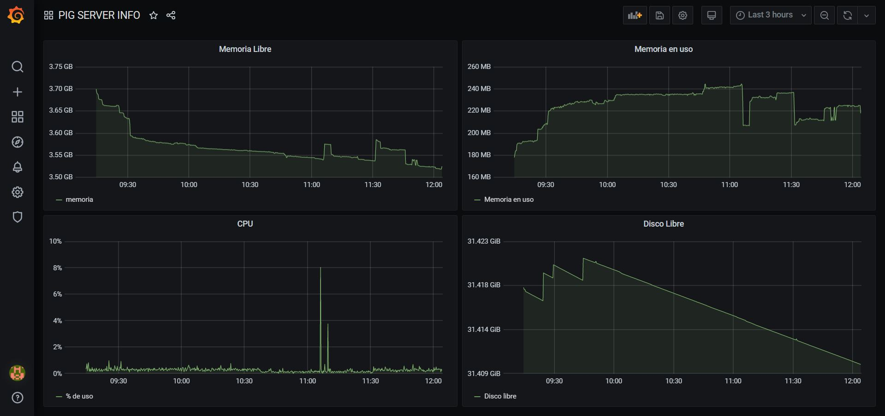
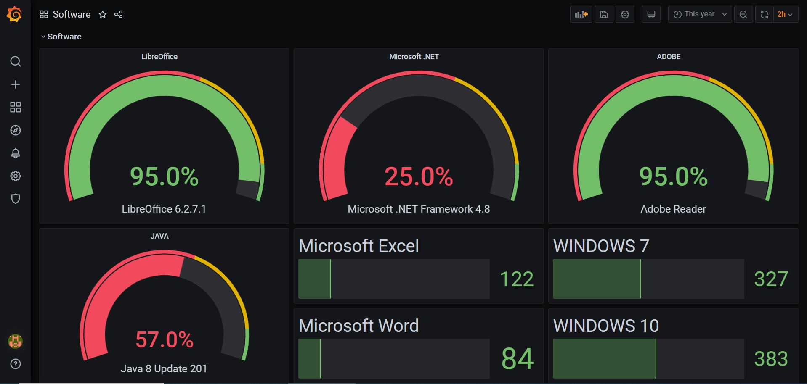

# A este proyecto le falta mucho para poder ponerse en producción, se presentó esta fase inicial como proyecto de fin de ciclo, se puede usar para hacer pruebas con Grafana pero todavía necesitaría mucho trabajo para poder usarse en una empresa.

## Descripción
> Este proyecto consiste en la integración de PostgreSQL, InfluxDB y Grafana con Telegraf y otras fuentes para la obtención de datos que nos permitan realizar una monitorización de nuestro parque informático de una forma ágil y visualmente atractiva.
> 
> La monitorización de los servidores se realizará en tiempo real y los datos de las estaciones de trabajo se consultarán de forma periódica, pudiendo programarse en intervalos personalizados.
> 
> Gracias a esta información podremos adelantarnos a posibles problemas y realizar las tareas preventivas antes de que se genere una incidencia, como falta de espacio en disco de un PC, consumo excesivo de RAM o CPU en un servidor entre otras.

## Puesta en marcha
> Descarga del fichero OVA - [PIG OVA](https://drive.google.com/file/d/1ZhQVDk2LGab1MRxckKi9QpxTjez0Fgcd/view?usp=sharing)
>
> Teniendo ya instalado Virtual Box se ejecuta el fichero OVA y se pulsa importar, se acepta el acuerdo de licencia y ya tendremos la máquina importada.
> 
> Se arranca la maquina y se verifica que dirección IP tiene asignada.
> 
> Usuario por defecto de Debian: root
> 
> Contraseña por defecto de Debian: abc123.
> 
> Para acceder a Grafana - https://*Direccion-IP*:3000
> 
> Usuario por defecto de Grafana: admin
> 
> Contraseña por defecto de Grafana: abc123.
>

## Uso

> Podrás ver la información almacenada accediendo a Grafana, desde ahí podrás visualizar los datos de las estaciones de trabajo y los servidores.
> 
> 
> 
> 

## Sobre el autor

> Me llamo Santiago Prego, soy de Galicia y llevo más de quince trabajando en TI, actualmente trabajo dando soporte de segundo nivel en el sector sanitario.
> 
> Siempre que puedo me gusta aprender cosas nuevas, y especialmente, si son relacionadas con las nuevas tecnologías. Actualmente estoy empezando en el campo de la seguridad informática, un campo muy interesante y también bastante amplio. De vez en cuando participo en algún evento [CTF](https://ctftime.org/ctf-wtf/), suelen ser interesantes para llevar a la práctica la teoría aprendida en este ámbito.
> 
> He decidido hacer este proyecto porque tenía la idea de hacer algo así hace tiempo y puede venir bien para el trabajo.
> 
> Podéis contactar conmigo o saber mas sobre mí a través de:
> 
> http://es.linkedin.com/in/santiagoprego
> 
> [pretocc (Santiago Prego) · GitHub](https://github.com/pretocc)
> 
> [santiagoprego@gmail.com](mailto:santiagoprego@gmail.com)
> 
> [www.santiagoprego.es](http://www.santiagoprego.es)

## Licencia

> Todo el software desarrollado en este proyecto está sujeto a la licencia [GPL v3](LICENSE)
> 
> Este proyecto contiene software desarrollado por terceros el cual se rige por sus propias licencias.
> 
> * Grafana - [Apache License 2.0](https://github.com/grafana/grafana/blob/master/LICENSE)
> * InfluxDB - [MIT License](https://github.com/influxdata/influxdb/blob/1.8/LICENSE)
> * Telegraf - [MIT License](https://github.com/influxdata/telegraf/blob/master/LICENSE)
> * PostgreSQL - [PostgreSQL License](https://www.postgresql.org/about/licence/)
> * Debian - [Informacion de licencia](https://www.debian.org/legal/licenses/index.es.html)

## Índice

> 1. Anteproyecto
>    * 1.1. [Idea](doc/templates/1_idea.md)
>    * 1.2. [Necesidades](doc/templates/2_necesidades.md)
> 2. [Análisis](doc/templates/3_analise.md)
> 3. [Planificación](doc/templates/4_planificacion.md)
> 4. [Diseño](doc/templates/5_deseño.md)
> 5. [Implantación](doc/templates/6_implantacion.md)

## Guía de contribución

> Para colaborar con el proyecto puedes informar de errores, enviar correcciones o solicitar nuevas funcionalidades. 
> 
> [Issues](https://gitlab.iessanclemente.net/dashboard/issues?assignee_username=a15santiagopl)
> 
> [Merge Requests](https://gitlab.iessanclemente.net/dashboard/merge_requests?assignee_username=a15santiagopl)
> 
> También puedes ponerte en contacto conmigo a través del siguiente correo:
> 
> santiagoprego@gmail.com
> 
> La creación de nuevos módulos será una gran forma de contribuir al proyecto.
