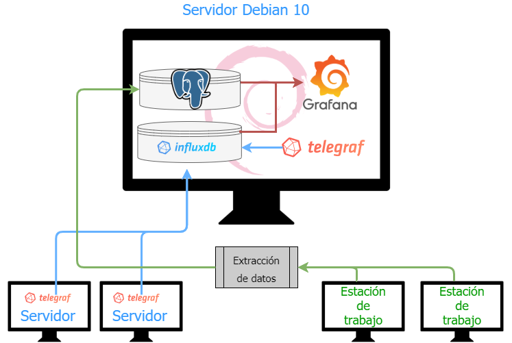

# Idea de proyecto

> ## Resumen
> 
> Para mi proyecto la idea que tengo pensado desarrollar está orientada a realizar la integración de un sistema de seguimiento y monitorización de los equipos de una red.
> 
> El proyecto consta de varias fases, por una parte está la configuración de un servidor basado en Debian 10 donde se instalará y configurará el siguiente software:
> 
> - [Grafana](https://grafana.com/)
> 
> Es un software que permite la visualización y el formato de datos métricos con el cual podremos mostrar unos valores seleccionados en un momento dado. Con el generamos unos paneles de monitorización que contendrán gráficas de monitorización usando los datos almacenados.
> 
> - [InfluxDB](https://www.influxdata.com/time-series-platform/)
> 
> Es una base de datos centrada en el almacenamiento de series de tiempo que utilizare para almacenar la información proveniente de los servidores y mostrar en tiempo real su estado.
> 
> - [PostgreSQL](https://www.postgresql.org/)
> 
> Esta base de datos relacional se empleará para el almacenamiento de la información sobre las estaciones de trabajo. Estos datos no se gestionan en tiempo real sino que se irán actualizando de forma periódica.
> 
> - [Telegraf](https://www.influxdata.com/time-series-platform/telegraf/)
> 
> Es un agente que correrá en los servidores y almacenará las métricas seleccionadas en InfluxDB para después mostrarlas desde Grafana. 
> Este agente quedará instalado y configurado en el propio servidor para poder mostrar su estado.

> La segunda fase del proyecto se encargará de realizar un software para el escaneo de la red y recopilar la información de las estaciones de trabajo para almacenarlas en PostgreSQL. 
> 
> La entrega de esta parte dependerá del tiempo disponible después de finalizar la primera, que será el objetivo principal del proyecto de fin de ciclo. En caso de no poder entregar el software completo se entregará una muestra de recopilación de datos de un equipo Windows mediante WMI y su almacenamiento en la base de datos PostgreSQL.
> 
> Una tercera fase será la creación de un cliente CRUD para los datos de las estaciones de trabajo, que se detallará en el proyecto pero sin desarrollarse.
> 
> En este cliente podremos consultar los datos de un equipo en concreto y añadir notas sobre las intervenciones realizadas así como el identificador del *ticket* asociado a dicha intervención, si existe, y el nombre del técnico que las realiza.

> ## Publico objetivo
> 
> El público objetivo al cual va dirigido este proyecto son los departamentos de soporte de empresas con un parque informático de tamaño medio o grande.

> ## Tipo de proyecto
> 
> Crearé un entregable que consistirá en un fichero OVA que contendrá el servidor listo para desplegar con todo configurado y una serie de gráficas predefinidas, así como una base de datos diseñada y creada en PostgreSQL para almacenar la información de las estaciones de trabajo.
> 
> El entregable deberá de ser ligero y no sobrepasar los 2GB.

> # Esquema del proyecto
> 
> En esta imagen se pueden ver los diferentes componentes y la interacción entre ellos. Las flechas indican el flujo de los datos hacia la base de datos correspondiente y de ahí hacia Grafana donde se procesarán y mostrarán.

> 
