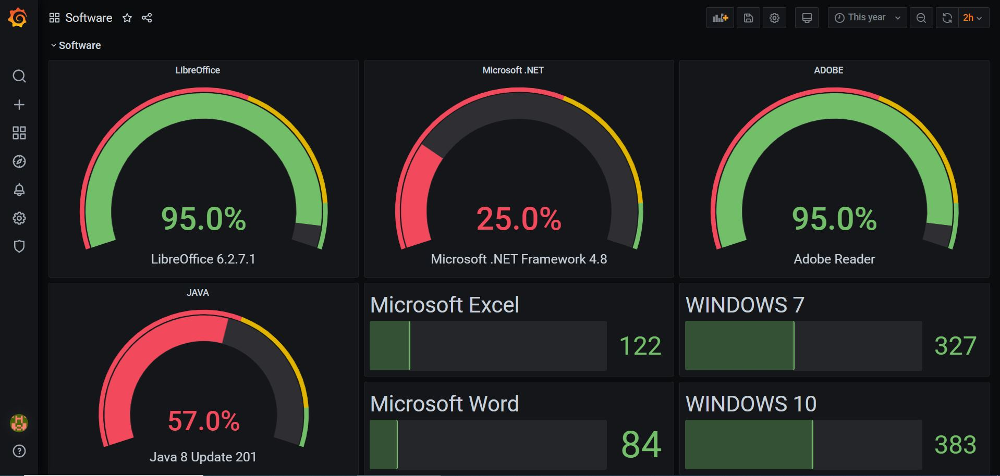

# REQUERIMIENTOS DEL SISTEMA

Este documento describe los requerimientos para PIG especificando que funcionalidades ofrecerá y de que forma.

## Descripción General

> El proyecto consta de varias fases, por una parte está la configuración de un servidor basado en Debian 10 donde se instalará y configurará el siguiente software:
> 
> - [Grafana](https://grafana.com/)
> 
> Es un software que permite la visualización y el formato de datos métricos con el cual podremos mostrar unos valores seleccionados en un momento dado. Con el generamos unos paneles de monitorización que contendrán gráficas de monitorización usando los datos almacenados.
> 
> - [InfluxDB](https://www.influxdata.com/time-series-platform/)
> 
> Es una base de datos centrada en el almacenamiento de series de tiempo que utilizare para almacenar la información proveniente de los servidores y mostrar en tiempo real su estado.
> 
> - [PostgreSQL](https://www.postgresql.org/)
> 
> Esta base de datos relacional se empleará para el almacenamiento de la información sobre las estaciones de trabajo. Estos datos no se gestionan en tiempo real sino que se irán actualizando de forma periódica.
> 
> - [Telegraf](https://www.influxdata.com/time-series-platform/telegraf/)
> 
> Es un agente que correrá en los servidores y almacenará las métricas seleccionadas en InfluxDB para después mostrarlas desde Grafana. 
> Este agente quedará instalado y configurado en el propio servidor para poder mostrar su estado.

> La segunda fase del proyecto se encargará de realizar un software para el escaneo de la red y recopilar la información de las estaciones de trabajo para almacenarlas en PostgreSQL.

## Funcionalidades

El proyecto PIG ofrecerá una funcionalidad principal que se subdividirá en dos.

Funcionalidad principal:

    Mostrar el estado de nuestros sistemas informáticos de una forma visual.

Monitorización de servidores:

    Una de las funcionalidades en que se subdividirá es la monitorización de los servidores en tiempo real.

Información sobre las estaciones de trabajo:

    La otra funcionalidad en la que se subdivide es el almacenamiento de los datos sobre las estaciones de trabajo.

## Requerimientos no funcionales

Se busca crear un proyecto que muestre la información de una forma visual, que sea modular, fácilmente escalable y que necesite poco mantenimiento.

## Tipos de usuarios

Se podrán crear distintos tipos de usuarios en función de las necesidades.

Ejemplo:

- Usuario técnico:
  - Podrá visualizar todo o parte de los datos pero no alterarlos.
- Usuario administrador:
  - Podrá visualizar y agregar nuevos datos al sistema.

## Casos de uso

Visualizar diagramas:

- Actor principal: Usuario técnico
- Descripción: El usuario accede para visualizar las gráficas de los datos en Grafana.
- Frecuencia: Alta
- Precondiciones: El usuario tiene que estar validado correctamente en Grafana.
- Postcondiciones: El usuario tiene que seleccionar que panel quiere visualizar.

Agregar fuentes de datos:

- Actor principal: Usuario administrador
- Descripción: El administrador accede para agregar una fuente de datos.
- Frecuencia: Baja
- Precondiciones: El usuario tiene que estar validado correctamente en Grafana.
- Postcondiciones: La fuente de datos se agrega a Grafana.

Agregar panel de datos:

- Actor principal: Usuario administrador
- Descripción: El administrador accede para agregar un panel de datos.
- Frecuencia: Baja
- Precondiciones: El usuario tiene que estar validado correctamente en Grafana.
- Postcondiciones: El panel de datos se agrega a Grafana.

        

## Evaluación de la viabilidad técnica del proyecto

### Hardware requerido

Las máquinas virtuales generan un alto consumo de memoria RAM y disco, por lo que es necesario un sistema con suficiente memoria RAM y un disco rápido para que el rendimiento del sistema y la experiencia de usuario sean correctas.

CPU: Intel Core i7 o AMD Ryzen 7

RAM: 16 GB

DISCO: 256 GB SSD

## Interfaces externos

El proyecto contará con las siguientes interfaces:

### Interfaz de usuario

        Un interfaz de usuario desde la que se podrán visualizar los datos.

        

### Interfaces software

    **Influxdb** - desde el cual realizará conexiones Telegraf

    **PostgreSQL** - desde el cual realizará conexiones el script de recopilación de datos.

## Actividades

A continuación se detallan las actividades necesarias para llevar a cabo el proyecto.

- Instalación de un Debian 10 en una máquina virtual.

- Instalación y configuración de Grafana

- Instalación y configuración de InfluxDB

- Instalación y configuración de Telegraf

- Instalación y configuración de PostgreSQL

- Diseño y creación de una base de datos en PostgreSQL

- Creación de un certificado autofirmado para habilitar el acceso a las aplicaciones web a través de https.

- Exportación de la máquina virtual a un fichero .OVA basado en el estándar OVF.

- Creación de un manual de usuario y un manual de administración.

Actividades extra si se dispone de tiempo suficiente.

- Creación de un software para la búsqueda automática de equipos en la red y recopilación de datos de los mismos.

## Mejoras futuras

Diseño de una aplicación CRUD para los datos de las estaciones de trabajo desde la cual se podrán introducir datos sobre las tareas realizadas en los equipos.

Integrar el proyecto con una herramienta de *ticketing*.
