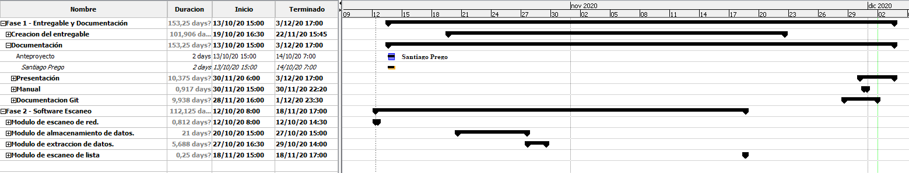

# FASE DE PLANIFICACIÓN DEL PROYECTO

## Objetivos del proyecto

## Guía de planificación del proyecto

### Metodología

    Dado que la mayoría de metodologías de desarrollo están orientadas a casos en los que existe mas de un programador (SCRUM, Agile, Kanban, etc) no me ceñiré a ninguna específica, en mi caso usaré una metodología propia en la que dividiré el proyecto en varias fases dentro de las cuales habrá una lista de tareas que se irán haciendo de forma secuencial. 

### Fases planificadas

Estas son las fases planificadas para desarrollar el proyecto PIG.

#### Fase 1: Creación del entregable

- Instalación de un Debian 10 en una máquina virtual.

- Instalación y configuración de Grafana

- Instalación y configuración de InfluxDB

- Instalación y configuración de Telegraf

- Instalación y configuración de PostgreSQL

- Diseño y creación de una base de datos en PostgreSQL

- Creación de un certificado autofirmado para habilitar el acceso a las aplicaciones web a través de https.

- Exportación de la máquina virtual a un fichero .OVA basado en el estándar OVF.

#### Fase 2: Software escaneo

- Módulo de escaneo.
  
  - Escaneo de un rango de direcciones IP.
  
  - Escaneo de una lista de equipos.

- Módulo de extracción de datos.
  
  - Conexión WMI a los equipos.
  
  - Extracción de datos.

- Módulo de almacenamiento de datos.
  
  - Diseño de la base de datos de ejemplo.
  
  - Conexión a la base de datos.
  
  - Almacenamiento de los datos extraídos con el modulo de extracción.

### Diagrama de Gantt

### Gastos necesarios.

    Logotipo del proyecto - 5.59€ - Empresa Tailor Brands

    No se requiere pago de ninguna licencia de software.

### WEBGRAFÍA

https://grafana.com/docs/grafana/latest/installation/debian/

https://docs.influxdata.com/influxdb/v1.8/

https://www.robvanderwoude.com/wmiqueries.php

https://www.blackhat.com/docs/us-15/materials/us-15-Graeber-Abusing-Windows-Management-Instrumentation-WMI-To-Build-A-Persistent%20Asynchronous-And-Fileless-Backdoor-wp.pdf

https://docs.microsoft.com/en-us/windows/win32/wmisdk/securing-a-remote-wmi-connection

https://www.psycopg.org/docs/usage.html?highlight=procedure

http://timgolden.me.uk/python/wmi/index.html

http://www.maxpython.com/packages/querying-wmi-using-python.php

https://www.albertcoronado.com/2020/04/08/monitorizacion-de-servidores-con-grafana-telegraf-e-influxdb/

http://richardn.ca/2019/01/17/running-grafana-locally-on-https-2/

